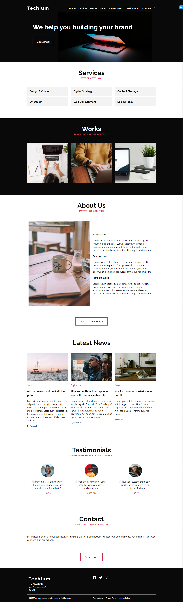

# Responsive Design for Techium



## Description

This shows the usage of media queries to make the site responsive for different screen sizes.

## Table of Contents

- [Installation](#installation)
- [Usage](#usage)
- [Contributing](#contributing)
- [License](#license)
- [Wireframe](#see-wireframe)

## Installation

To set up and run this project locally, follow these steps:

```bash
# Clone the repository
git clone https://github.com/eadewusic/alu-web_front_end.git

# Change directory to the project folder
cd Techium

# Install dependencies (if any)
npm install
```

## Usage

To use the "Responsive Design" landing page, follow these instructions:

1. Include the HTML file in your project/ rather copy the `10-index.html` file from `responsive_design`:

   ```html
   <link rel="stylesheet" href="./article.css" />
   ```

2. Customise the page according to your needs.

## Contributing

I welcome contributions to this project! If you'd like to contribute, please follow these guidelines:

1. Fork the repository.

2. Create a new branch for your feature or bug fix.

3. Make your changes and commit them with descriptive messages.

4. Submit a pull request to the `main` branch.

## License

This project will be licensed under the [MIT License](LICENSE). You can find the full text of the license in the [LICENSE](LICENSE) file later.

## Acknowledgments

I'm yet to use any third-party libraries, assets, or tools in this project. I will acknowledge them here and provide links to their repositories or websites if I do in future.

## Contact

If you have any questions, feedback, or collaboration requests, please feel free to reach out to us at [e.adewusi@alustudent.com](mailto:e.adewusi@alustudent.com).

## See Wireframe


