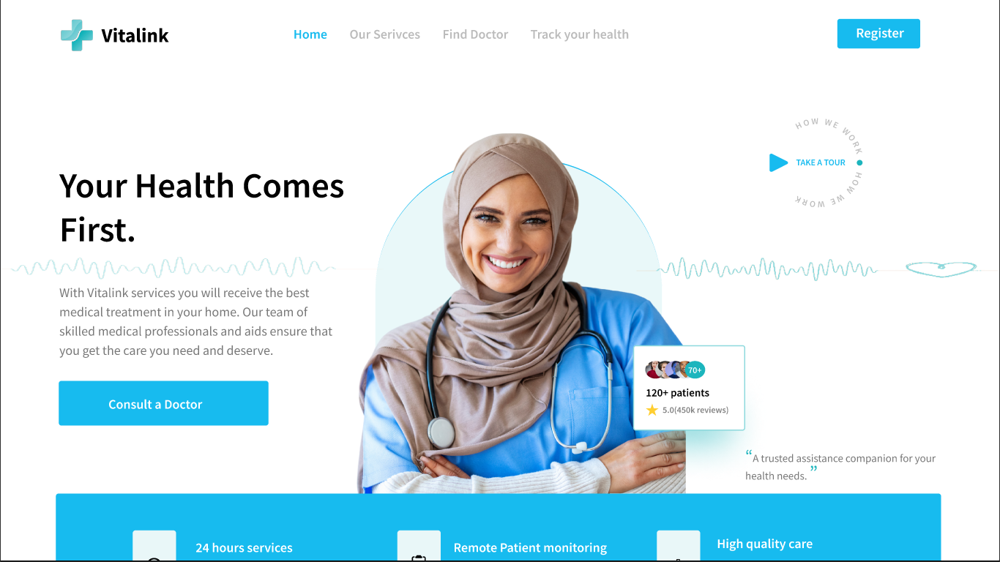
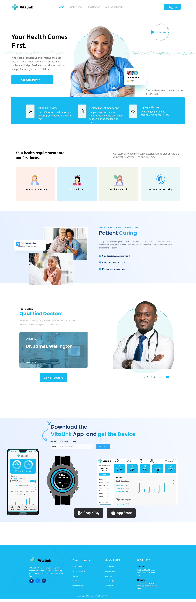

# VITALINK - Healthcare Monitoring System


Welcome to VITALINK, your comprehensive solution for remote healthcare monitoring and management.

## Table of Contents

- [Introduction](#introduction)
- [Key Features](#key-features)
- [Installation](#installation)
- [Project Structure](#project-structure)
- [Contributing and Support](#contributing-and-support)
- [Full Page](#full-page)

## Introduction

VITALINK is a remote patient monitoring system designed to improve healthcare accessibility by leveraging wearable and mobile technology. This platform enables continuous tracking of vital signs and health metrics for individuals with chronic illnesses, reducing the need for frequent hospital visits and facilitating early intervention.

## Key Features

- **Remote Monitoring:** Continuous tracking of vital signs such as heart rate, blood pressure, and blood glucose levels.
- **Alerts and Notifications:** Instant alerts for abnormal readings or health emergencies.
- **Appointment Booking:** Convenient scheduling of appointments from home, saving time and costs for patients.
- **Enhanced Communication:** Seamless communication between patients and healthcare providers through secure messaging features.
- **Personal Health Dashboard:** Access a personalized dashboard to view health data trends, track medication adherence, and set health goals.
- **Secure Data Storage:** Ensure the secure storage and transmission of patient data in compliance with healthcare regulations.
- **Telemedicine Integration:** Seamlessly integrate with telemedicine platforms for virtual consultations and follow-ups.

## Installation

To set up and run this project locally, follow these steps:

```bash
# Clone the repository
git clone https://github.com/Chidera0001/VITALINK.git

# Change directory to the project folder
cd VITALINK

# Install dependencies (if any)
npm install
```

## Project Structure

- **Homepage:** The landing page of the website introducing VITALINK and its features.
- **Login and Sign Up Pages:** Pages for user authentication and registration.
- **Book Appointment Pages:** Pages for scheduling appointments with healthcare providers.
- **Monitoring Dashboard:** Dashboard for patients to view their health data trends, track medication adherence, and set health goals. [Pending]
- **Communication Platform:** Secure messaging and video consultation tools for seamless communication between patients and healthcare providers. [Pending]

## Contributing and Support

We welcome contributions from the community to enhance VITALINK and make healthcare more accessible for everyone. To contribute, please contact us on a.ntwali@alustudent.com for procedures. You can also reach out for any questions, we are here to help!

## Full Page


